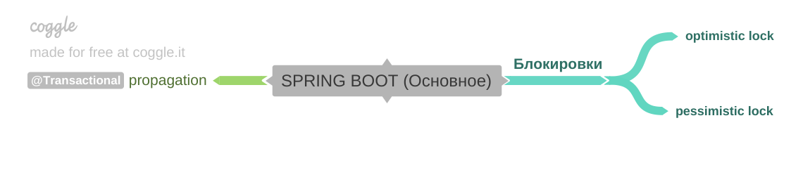
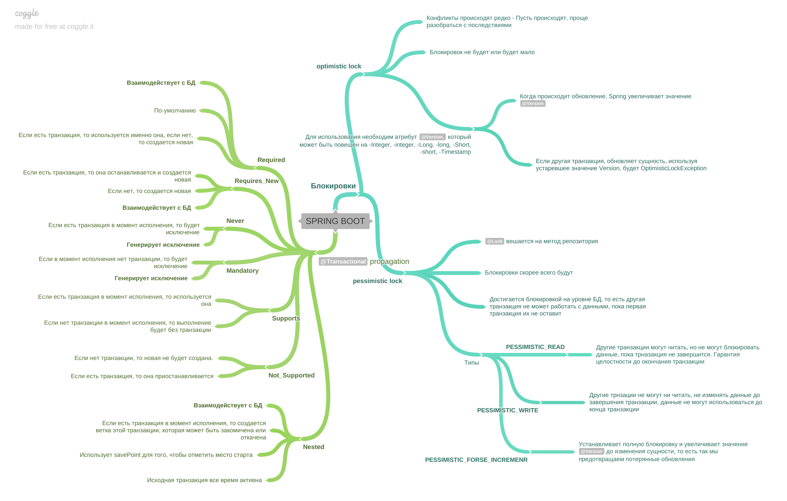

[Вернуться к оглавлению](https://github.com/engine-it-in/different-level-task/blob/main/README.md)
***

***
* [Spring Boot](#spring-boot)
  * [Locks in case of @Transaction annotation using](#locks-in-case-of-transaction-annotation-using)
    * [Optimistic Lock](#optimistic-lock)
    * [Pessimistic Lock](#pessimistic-lock)
      * [PESSIMISTIC_READ](#pessimisticread)
      * [PESSIMISTIC_WRITE](#pessimisticwrite)
      * [PESSIMISTIC_FORCE_INCREMENT](#pessimisticforceincrement)
  * [@Transactional](#transactional)
    * [Transaction Propagation (распространение).](#transaction-propagation--распространение--)
      * [Отличия между Nested и Requires_new](#отличия-между-nested-и-requiresnew)
***

***
[Визуальный конспект](https://coggle.it/diagram/Ztd69DbVpak0WJ9J/t/-/1b1ac2a4d115a19522d948db0f3e823b7d3a966e9e0a126ac712db46255cef8e)
***

# Spring Boot
## @Transaction - способ управления транзакциями
## Locks in case of @Transaction annotation using
Различают 2 стратегии блокировок: 
* `Optimistic` - требует меньше ресурсов, т.к. не удерживает блокировки в БД;
* `Pessimistic`;

### Optimistic Lock

* Предполагается, что блокировок не будет или будет, но слишком мало, чтобы блокировать записи 
и жертвовать производительностью; 
* Для использования данного типа блокировки необходимо создать атрибут, с аннотацией `@Version`
  * Атрибут может быть типов `Integer`, `integer`, `Long`, `lon`, `Short`, `short`, `java.SQL.Timestamp`;
* Предполагается, что конфликты изменений происходят редко и что лучше позволить конфликтам происходить, 
а затем разрешать их, чем блокировать доступ к данным для предотвращения конфликтов;
* Когда `SomeEntity` обновляется в БД, JPA автоматически увеличивает значение поля 
`version`; 
* Если другая транзакция попытается обновить ту же запись, используя устаревшее 
значение версии, JPA выбросит `OptimisticLockException`, сигнализируя о конфликте;

### Pessimistic Lock

* Предполагается, что блокировка скорее всего будет; 
* Достигается путем блокировки записей на уровне базы данных, так что другие транзакции не могут читать или 
изменять эти записи до тех пор, пока блокировка не будет снята; 
* Аннотация `@Lock` вешается на метод репозитория (к примеру).

#### PESSIMISTIC_READ

* Другие транзакции **могут читать данные, но не могут применять к ним блокировки на запись**, 
пока первоначальная транзакция не завершится; 
* Гарантирует, что данные не будут изменены другими транзакциями до завершения текущей транзакции:
  * Чтение данных другими транзакциями остается возможным;

#### PESSIMISTIC_WRITE

* Другие транзакции не могут **ни читать, ни изменять заблокированные данные** до тех пор, 
пока блокировка не будет снята. Обычно это происходит после завершения транзакции; 
* Используется, когда необходимо полностью предотвратить доступ других транзакций к 
данным на время выполнения операции;

#### PESSIMISTIC_FORCE_INCREMENT

* Не только устанавливает блокировку на запись, но также увеличивает значение версии 
(`@Vesion`) сущности в базе данных, даже если сущность не была изменена;
* Это полезно, когда необходимо увеличить версию сущности для предотвращения 
**потерянных обновлений** (lost updates), когда одновременно выполняются 
несколько транзакций, влияющих на одни и те же данные.

## @Transactional

### Transaction Propagation (распространение).

Исключительно про Spring, не имеет отношения к БД. Опции взаимодействия с БД.

| Уровень       | Описание                                                                                                           | Взаимодействие с JDBC | Ошибка |
|---------------|--------------------------------------------------------------------------------------------------------------------|-----------------------|--------|
| Required      | (Устанавливается по-умолчанию) Если есть `T1` - используется она. Если нет - необходимо создать транзакцию         | Дa                    | Нет    |
| Requires_New  | Если есть `T1`, создастся новая `T2` (`T1` будет приостановлена). Если нет - создастся новая `T1`                  | Да                    | Нет    |
| Never         | Если есть `T1` - будет исключение                                                                                  | Нет                   | Да     |
| Mandatory     | Если нет `T1` - будет исключение                                                                                   | Нет                   | Да     |
| Supports      | Если есть `T1` - используется она. Если нет - будет без транзакции                                                 | Нет                   | Нет    |
| Not_Supported | Если `T1` нет, то новая не будет создана. Если `T1` есть - она будет приостановлена                                | Нет                   | Нет    |
| Nested        | Если есть `T1`, создастся `T1.1`, которая может быть `commit` или `rollback` - это не повлияет на продолжение `T1` | Да                    | Нет    |

#### Отличия между Nested и Requires_new

* `Requires_new` тормозит `T1` и начинает `T2`. `Nested` - это часть `T1`;
* `Nested` использует save points для того, чтобы отметить, где в рамках `T1` она была начата; 
  * В случае отката, он происходит до последнего savepoint'а. 
  * `T1` на протяжении всего времени остается активной; 
  * `T1` откатывает все Nested;