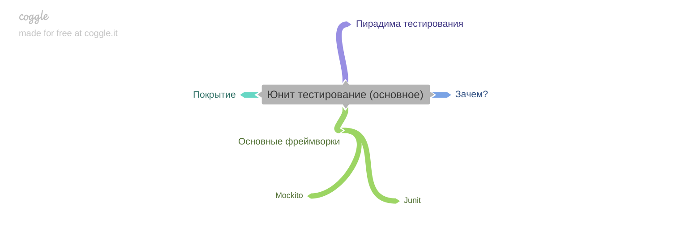
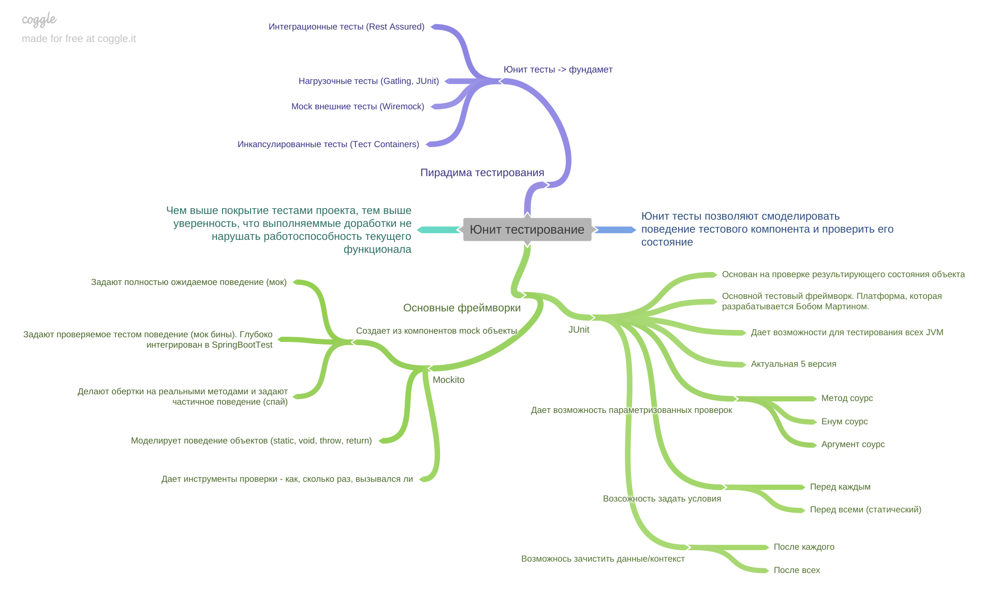

[Вернуться к оглавлению](https://github.com/engine-it-in/different-level-task/blob/main/README.md)
***

***
# Unit-Tests
***

***
[Визуальный конспект](https://coggle.it/diagram/ZtYOehw8ivTpSMw_/t/-/42af261401738f0bd7fff01ce4c436a96d55438560fb6c83adda0dca20568e6f)
***
Инструменты тестирования:

- [Mockito](../../first%20level/mockito/README.md)
- [JUnit](../../first%20level/junit/README.md)
- [TestContainers](../../first%20level/tc/README.md)