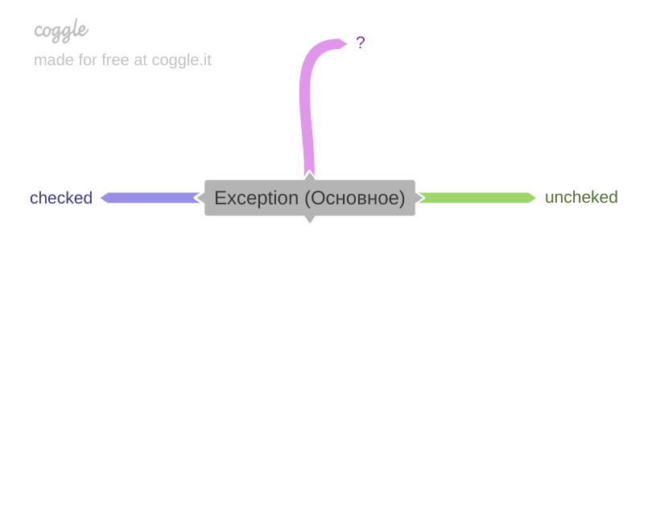
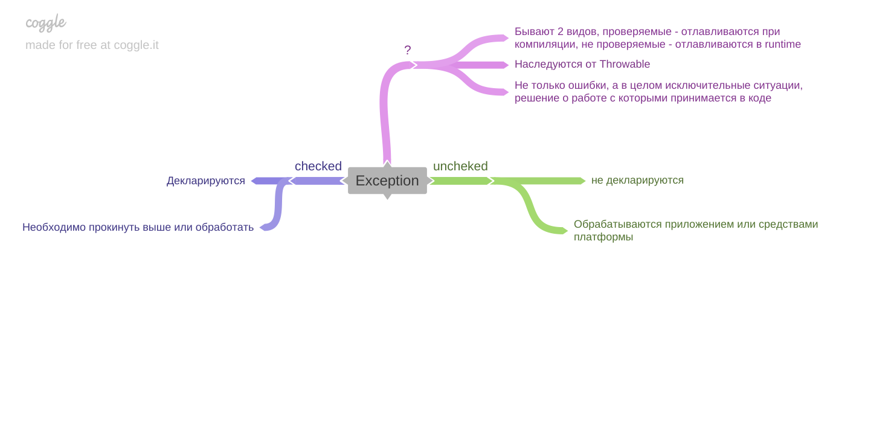

[Вернуться к оглавлению](https://github.com/engine-it-in/different-level-task/blob/main/README.md)
***

***
# Java Exceptions
- [Java Exceptions](#java-exceptions)
    * [Classification](#classification)
    * [Hierarchy](#hierarchy)
***

***
[Визуальный конспект](https://coggle.it/diagram/ZuQP66WLaORT25zu/t/exception/bf0093828147289ab94d4ce0e8eb4e4264a8272b5b1a6166fa537fa3052498a6)
***

Исключения:
* Назначение - сообщить об исключительной ситуации (может быть и ошибка) в процессе исполнения кода;

## Classification
Подразделяются на `checked` и `unchecked`.

### Checked 
* Обязательны для декларирования в сигнатуре метода. 
* Код, вызывающий метод, в сигнатуре которого есть `checked` исключение, обязан:
  * прокинуть его выше;
  * обработать;

> С точки зрения Роберта Мартина (Чистый код) являются типичным примером нарушения 
> принципа единой ответсвенности программного компонента; 

### Unchecked 
* Не декларируются в сигнатуре; 
* Обрабатываются средствами платформы;

## Hierarchy

* Корневое исключение - `Throwable` 
  * Сhecked-исключение; 
* От него наследуется 
  * `Error` - unchecked;
    * Ошибки возникающие при работе java - исключения, связанные с памятью, JVM;
  * `Exception` - checked; 
    * Исключения в их широком понимании; 
    * Подразделяются на RuntimeException (unchecked) и другие (checked);