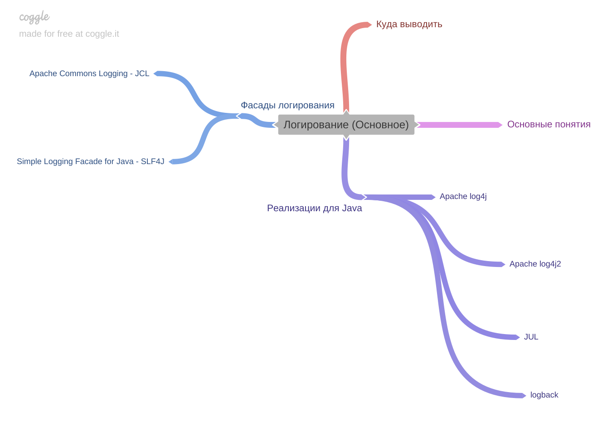
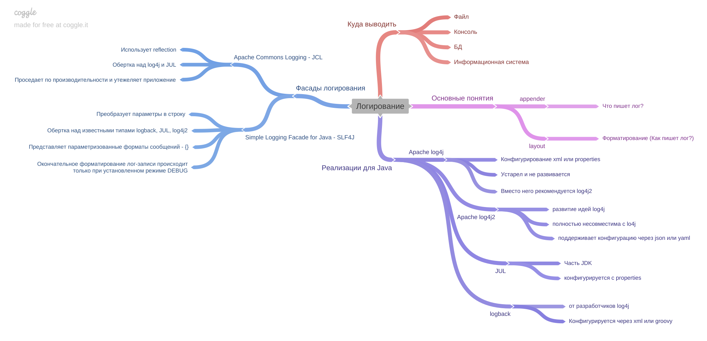

[Вернуться к оглавлению](https://github.com/engine-it-in/different-level-task/blob/main/README.md)
***

***
* [Библиотеки логирования в Java](#библиотеки-логирования-в-java)
  * [Куда выводить логи:](#куда-выводить-логи-)
  * [Основные понятия:](#основные-понятия-)
  * [Наиболее популярные РЕАЛИЗАЦИИ:](#наиболее-популярные-реализации-)
  * [Фасады логирования](#фасады-логирования)
***

***
[Визуальный конспект](https://coggle.it/diagram/ZuP_HKWLaORTxyWt/t/%D0%BB%D0%BE%D0%B3%D0%B8%D1%80%D0%BE%D0%B2%D0%B0%D0%BD%D0%B8%D0%B5/2b0f7dfc87efa8aa04f1eaae8862ee294a2a803912497c085723b58f64bc52d1)
***

# Библиотеки логирования в Java

## Куда выводить логи:
* Консоль; 
* Файл;
* Иное 
  * БД; 
  * Информационные системы;

## Основные понятия:
- `appender` - что пишет лог;
- `layout` - форматирование;

## Наиболее популярные РЕАЛИЗАЦИИ:
| Библиотека логирования  | Описание                                                                                                                                                                           |
|-------------------------|------------------------------------------------------------------------------------------------------------------------------------------------------------------------------------|
| Apache log4j            | Конфигурируется через `xml` или `properties`. Устарел и не развивается. Вместо него рекомендуется использовать log4j2.                                                             |
| Apache log4j2           | Продолжение log4j. Полностью несовместима с log4j. Поддерживает конфигурации через `json` и `yaml`, но не поддерживает `properties` конфигурации и конфигурации от log4j на `xml`. |
| JUL (java.util.logging) | Является частью JDK. Настраивается только с помощью `properties`.                                                                                                                  |
| Logback                 | Разработана создателями log4j. Может быть сконфигурирована через `xml` и `groovy`.                                                                                                 |

## Фасады логирования
* Apache Commons Logging - JCL;
  * JCL - это обертка над log4j и JUL;
  * Внутри себя она часто использует reflection -> проседает по производительности и утяжеляет приложение;
* Simple Logging Facade for Java - SLF4J;
  * Является оберткой над всеми известными логерами типа logback, log4j, jul и т.д.
  * Предоставляет параметризованные форматирования сообщений ({}); 
  * Преобразует параметры в строку; 
  * Окончательное форматирование лог-записи происходит только при установленном уровне DEBUG;