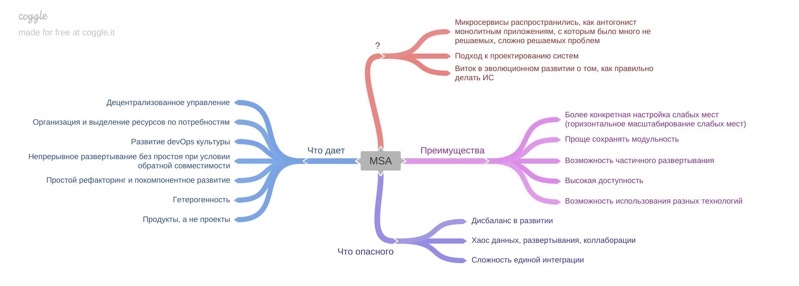

[Вернуться к оглавлению](https://github.com/engine-it-in/different-level-task/blob/main/README.md)
***
* [Что это?](#что-это)
  * [Преимущества](#преимущества-ма-и-монолитной-архитектур)
  * [Что дает МА?](#что-дает-ма)
  * [Что опасного?](#что-опасного)
***

***
[Визуальный конспект](https://coggle.it/diagram/ZuH-n3dV1iFRi9EF/t/-/f83212b6e6ea8ccd5990f5f24ac66458f3a8d76d7c5a96b518dc9b32717df9dd)
***

# Микросервисная архитектура (MA)

# Что это?
* Подход к проектированию и реализации информационных систем (ИС);
* Микросервисная архитектура - виток в эволюционном осознании того, как "правильно" делать ИС;
  * Правильно - субъективная характеристика, которая идет от опыта;
  * Опыт, который диктует то, что МА - правильно, это опыт создания монолитных систем и крупных сервисов;
* То есть размышления о том, что МА - хорошо, обычно базируется на том, что монолит - плохо;
* На мой взгляд - монолит - не плохо: 
  * Организация работ по созданию и поддержке монолитов очень часто не была доведена до отлаженных процессов;
  * Как следствия - вместо монолита создавали комья функциональности;

## Преимущества МА и монолитной архитектур
| Монолитная архитектура                                     | МА                                                      |
|------------------------------------------------------------|---------------------------------------------------------|
| **Простота** реализации управления и единого развертывания | Возможность **частичного согласованного развертывания** |
| **Согласованность и унификация** разных частей кода        | Высокая **доступность**                                 |
| **Межмодульный рефакторинг**                               | Проще сохранять **модульность**                         |
|                                                            | Возможность использования разных технологий             |
## Что дает МА
* Непрерывное развёртывание;
* Развитие devOps культуры;
* Простоту рефакторинга и покомпонентного развития системы;
* Гетерогенность (разные версии, фреймворки, языки);
* Организация ресурсов в соответствии с потребностями;
* Продукты, а не проекты;
* Децентрализованное управление;

## Что опасного?
* Хаос данных, сервисов, коллаборации;
* Сложность единой интеграции;
* Дисбаланс в развитии;
