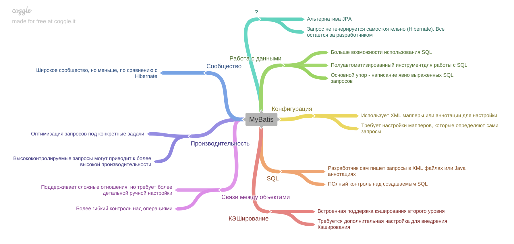

[Вернуться к оглавлению](https://github.com/engine-it-in/different-level-task/blob/main/README.md)
***
* [MyBatis](#mybatis)
  * [Подход к работе с данными](#подход-к-работе-с-данными)
  * [Настройка и конфигурация](#настройка-и-конфигурация)
  * [Генерация SQL-запросов](#генерация-sql-запросов)
  * [Поддержка кэширования](#поддержка-кэширования)
  * [Работа со сложными связями между объектами](#работа-со-сложными-связями-между-объектами)
  * [Изучаемость и простота использования](#изучаемость-и-простота-использования)
  * [Производительность](#производительность)
  * [Сообщество и поддержка](#сообщество-и-поддержка)
  * [Example mapper](#example-mapper)
***

***
[Визуальный конспект](https://coggle.it/diagram/ZuIC_4Kz-e0WNqjZ/t/mybatis/f76f6072039e2b44c345bfaf559e4eb8e8b8bd380dd059084278873cb940b08f
***

# MyBatis

* Альтернатива JPA, которая делает маппинг не на таблицу, а на sql-запрос;
* Запрос не генерируется самостоятельно (Hibernate), а все остается за разработчиком;
* JPA (Java Persistence API) и MyBatis - два различных подхода к управлению персистенцией данных в приложениях на Java; 

## Основные отличия:

### Подход к работе с данными
* Является полуавтоматизированным инструментом для работы с SQL;
  * Основной упор делается на написание явно выраженных SQL-запросов;
* Предоставляет больше контроля над SQL, но требует ручного написания запросов;

### Настройка и конфигурация

* Использует XML-мапперы или аннотации для настройки;
* Требует настройки SQL мэпперов, которые определяют запросы;

### Генерация SQL-запросов

* Разработчик сам пишет SQL-запросы в XML-файлах или Java-аннотациях;
* Обеспечивает полный контроль над создаваемым SQL;

### Поддержка кэширования

* Встроенная поддержка кэширования второго уровня (L2 caching);
* Требуется дополнительная настройка для использования кэширования;

### Работа со сложными связями между объектами

* Поддерживает сложные отношения, но требует более детальной ручной настройки;
* Вместе с тем, предоставляет более гибкий контроль над этими операциями;

### Изучаемость и простота использования

* Прост в изучении для тех, кто уже знаком с SQL;
* Требует большего объема кода для выполнения операций, что может упростить отладку и понимание;

### Производительность

* Позволяет оптимизировать запросы под конкретные задачи;
* Более высококонтролируемые запросы могут привести к высокой производительности, 
если управлять ими правильно;

### Сообщество и поддержка

* Также имеет активное сообщество, но менее массовое по сравнению с JPA.
* Более независимый и предоставляет более гибкие возможности.

### Example mapper

```java

@Mapper
public interface CrudMapper {
    @Select("""
            SELECT * FROM osago.quote
            WHERE uuid = #{uuid}
            """)
    Quote findByUuid(@Param("uuid") String uuid);

    @Select("""
            SELECT uuid, insert_date
            FROM osago.quote
            WHERE kasko_contract_number is not null
            """)
    List<Quote> findWithContractId();

    @Select("""
            SELECT count(*)
            FROM osago.quote
            WHERE kasko_contract_number is not null
            """)
    Integer findCountWithContractId();

    @Insert("""
            INSERT INTO osago.quote(uuid, insert_date, request, response)
            VALUES (#{uuid}, #{insertDate}, '', '')
            """)
    public Integer save(Quote quote);
}
```