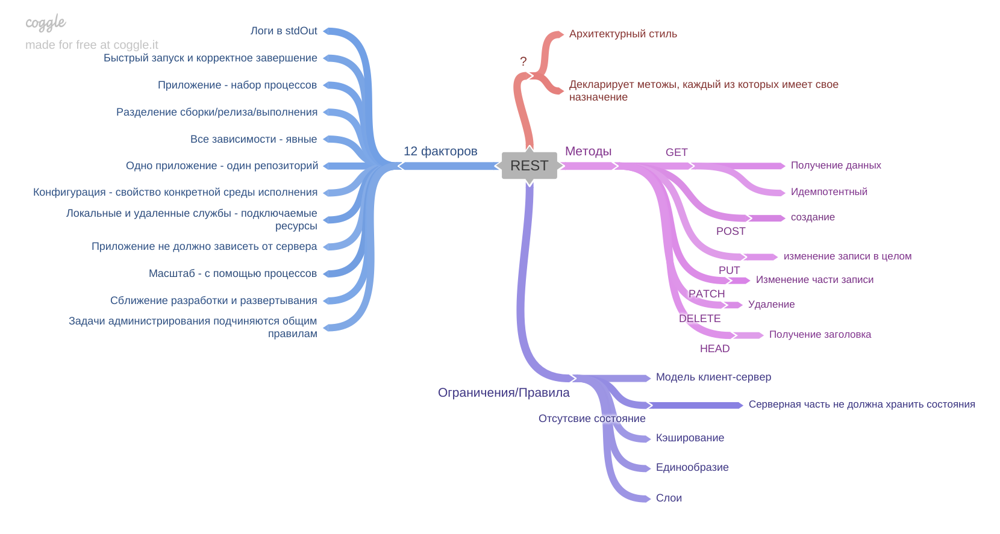

[Вернуться к оглавлению](https://github.com/engine-it-in/different-level-task/blob/main/README.md)
***

***
* [REST](#rest)
  * [Основные методы REST-взаимодействия:](#основные-методы-rest-взаимодействия-)
  * [Ограничения/правила:](#ограниченияправила-)
***

***
[Визуальный конспект](https://coggle.it/diagram/ZuU7Q4Kz-e0Wj7H1/t/-/2d35c04906ceba498bc72be28323f4f7aacb53be75aa51b01aa8a909f57d2b1e)
***

# REST

Архитектурный стиль **http**-взаимодействия.
Декларирует методы, каждый из которых имеет собственное назначение.

## Основные методы REST-взаимодействия:

* GET - получение;
  * Обладает идемпотентностью - то есть возвращает устойчивый результат;
* POST - создание;
* PUT - изменение записи в целом;
* PATCH - Замена части записи;
* HEAD - получения заголовка;
* DELETE - удаление;

## Ограничения/правила:

* Модель клиент-сервер;
* Отсутствие состояния - серверная часть не должна хранить состояния;
* Кэширование - позволяет снизить нагрузку на сервер;
* Единообразие интерфейса - позволяет масштабировать системы и развивать модули независимо друг от друга;
* Слои - позволяют защищаться и балансировать нагрузку;

## 12 факторов REST

* Одно приложение - один репозиторий;
* Все зависимости приложения должны быть явными;
* Конфигурация - свойство среды исполнения;
* Локальные и удаленные службы - подключаемые ресурсы;
* Разделение сборки, релиза, выполнения;
* Приложение - набор процессов;
* Приложение - не должно зависеть от сервера;
* Масштаб - с помощью процессов;
* Быстрый запуск и корректное завершение;
* Сближение разработки и развертывания;
* Логи в Stdout;
* Задачи администрирования должны подчиняться общим правилам;