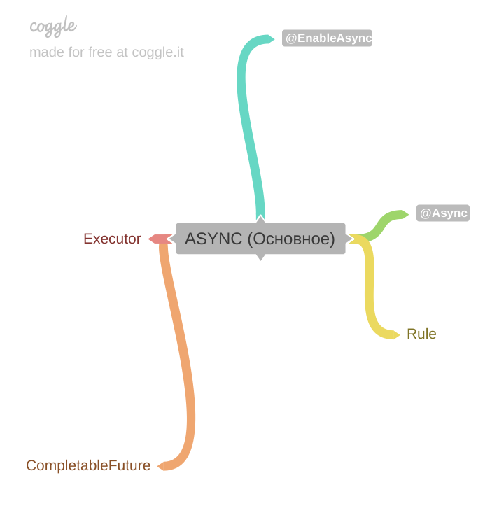
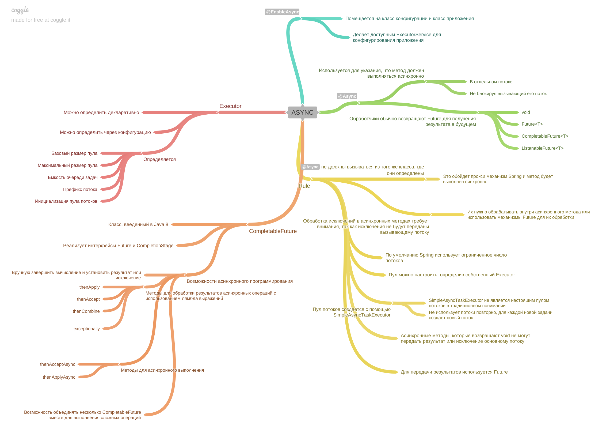

[Вернуться к оглавлению](https://github.com/engine-it-in/different-level-task/blob/main/README.md)
***

***
* [Async processes in applications](#async-processes-in-applications)
  * [@EnableAsync](#enableasync)
  * [@Async](#async)
  * [Use rules](#use-rules)
  * [CompletableFuture<T>](#completablefuture-t)
  * [Executor](#executor)
    * [Config via Properties](#config-via-properties)
    * [Manual configuration](#manual-configuration)
***

***
[Визуальный конспект](https://coggle.it/diagram/ZuCuOaWLaORTNVaJ/t/async/1e2d46aec1139122eb9524bce0e5fd46186933f1877d5cf669e65550144ad8d9)
***

# Async processes

## @EnableAsync
<
Помещается на конфигурацию, включает асинхронный режим обработки в Spring Boot.

```java
@Configuration
@EnableAsync
@RequiredArgsConstructor
@EnableConfigurationProperties(AsyncProperties.class)
public class AsyncConfiguration implements AsyncConfigurer {

  private final AsyncProperties asyncProperties;

  @Override
  @Bean
  public Executor getAsyncExecutor() {
    final ExecutorService executorService =
            Executors.newFixedThreadPool(asyncProperties.numberOfThreads());
    // DelegatingSecurityContextExecutorService используется для обращения к 
    // SecurityContextHolder внутри нитей, создаваемых с помощью Executor
    return new DelegatingSecurityContextExecutorService(executorService);
  }
}
```

## @Async

* Используется для указания, что метод должен выполняться асинхронно, 
  * То есть в отдельном потоке, не блокируя вызывающий его поток; 
  * Эти методы обычно возвращают 
    * `void` 
    * `Future<T>`, 
    * `CompletableFuture<T>`, 
    * `ListenableFuture<T>` 
  * для получения результата выполнения в будущем.

## Use rules

* Методы с `@Async` **не должны вызываться из того же класса**, где они определены; 
  * Это обойдет прокси-механизм Spring и метод будет выполнен синхронно;
* [Обработка исключений](../first%20level/ecxeptions/README) в асинхронных методах требует 
внимания, так как исключения не будут переданы вызывающему потоку; 
* Их нужно обрабатывать внутри асинхронного метода или использовать механизмы `Future` для
  их обработки;
* По умолчанию Spring использует пул потоков с ограниченным числом потоков; 
* Пул можно настроить, определив собственный `Executor`; 
* Пул потоков создается с помощью `SimpleAsyncTaskExecutor`; 
  * `SimpleAsyncTaskExecutor` не является настоящим пулом потоков в традиционном понимании; 
  * Он не повторно использует потоки. Вместо этого, он создает новый поток для каждой задачи;
* Асинхронные методы, возвращающие void, не могут передать результат выполнения 
или исключение вызывающему потоку; 
* Для передачи результатов или исключений используйте `Future` или его расширения;

## CompletableFuture<T>

* `CompletableFuture<T> `— это класс, введенный в Java 8; 
  * Реализует интерфейсы `Future<T>` и `CompletionStage<T>`;
  * Предоставляет более гибкие возможности для асинхронного программирования, включая:
    * Возможность вручную завершить вычисление и установить результат или исключение;
    * Методы для обработки результатов асинхронных операций с использованием 
функций и лямбда-выражений - `thenApply`, `thenAccept`, `thenCombine`, `exceptionally` 
и другие.
  * Методы для асинхронного выполнения следующих действий (`thenApplyAsync`, 
`thenAcceptAsync` и т.д.).
  * Возможность объединять несколько `CompletableFuture<T>` вместе для выполнения 
сложных асинхронных потоков.

## Executor

### Config via Properties

Применяются, если в конфигурации приложения не определен собственный `Executor`;

```yaml
spring:
  task:
    execution:
      pool:
        # минимальное количество потоков, которое будет поддерживаться в пуле, даже если они простаивают
        core-size: 5
        # максимальное количество потоков, которое может быть создано в пуле для обработки задач
        max-size: 6
        # максимальное число задач, которые могут ожидать выполнения; если очередь полна, то создаются новые потоки, пока их число не достигнет maxPoolSize
        queue-capacity: 10
      # задает префикс имени для потоков, создаваемых пулом
      thread-name-prefix: thread-
```
### Manual configuration

```java

@Configuration
@EnableAsync
public class AsyncConfig {

    @Bean(name = "customAsyncExecutor")
    public Executor customAsyncExecutor() {
        ThreadPoolTaskExecutor executor = new ThreadPoolTaskExecutor();
        executor.setCorePoolSize(5); // Установка базового размера пула потоков
        executor.setMaxPoolSize(10); // Установка максимального размера пула потоков
        executor.setQueueCapacity(100); // Установка емкости очереди задач ожидающих выполнения
        executor.setThreadNamePrefix("AsyncExecutor-"); // Установка префикса имени потоков
        executor.initialize(); // Инициализация пула потоков
        return executor;
    }
}
```

```java

@Service
public class AsyncService {

    @Async("customAsyncExecutor")
    public void asyncMethod() {
        // Выполнение асинхронной задачи
    }
}
```