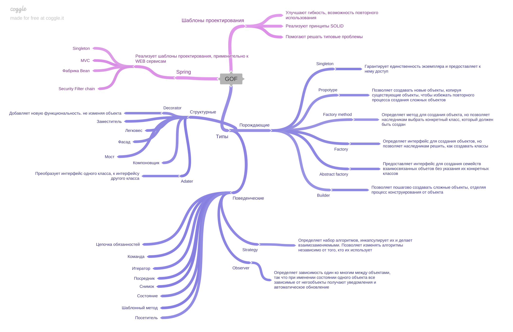

[Вернуться к оглавлению](https://github.com/engine-it-in/different-level-task/blob/main/README.md)
***

***
* [GOF (Gang of Four)](#gof--gang-of-four-)
  * [Concept](#concept)
  * [Spring](#spring)
  * [Patterns](#patterns)
    * [Singleton](#singleton)
    * [Factory Method](#factory-method)
    * [Factory](#factory)
    * [Abstract Factory](#abstract-factory)
    * [Builder](#builder)
    * [Prototype](#prototype)
    * [Adapter](#adapter)
    * [Decorator](#decorator)
    * [Observer](#observer)
    * [Strategy](#strategy)
***

***
[Визуальный конспект](https://coggle.it/diagram/ZtjBhhw8ivTps2S1/t/gof/6cd0470b9b487c3ae8f5249a31d3b4e51c4cf2c34afaff6d12cd36e30e3ae3f3)
***

# GOF (Gang of Four)

## Concept

* 23 популярных шаблона проектирования программного обеспечения; 
  * Помогают решать популярные, повторяющиеся задачи;
  * Улучшать гибкость и повторное использование кода;

## Spring

* Spring реализует шаблоны, которые перечисляются в GoF. 
  * Из примеров:
    * MVC - паттерн, в который входит @Controller;
      * Spring bean factory - создает singleton- бины, размещает их в контексте приложения;
       * Security filter chain - цепочка ответственностей, которая применяет фильтры безопасности к запросу;

## Patterns

### Singleton

* Гарантирует, что класс имеет только один экземпляр, и предоставляет глобальную точку доступа к этому экземпляру;

### Factory Method

* Определяет метод для создания объектов, но позволяет подклассам выбрать конкретный класс, который должен быть создан;

### Factory

* Определяет общий интерфейс для создания объектов, но позволяет подклассам решить, какие классы создавать;

### Abstract Factory

* Предоставляет интерфейс для создания семейств взаимосвязанных объектов без указания их конкретных классов; 
* Интерфейс фабрики, имплементируют конкретные фабрики, которые производят объекты типа интерфейса, которые имплементируют конкретные объекты;

### Builder
Позволяет создавать сложные объекты пошагово, разделяя процесс конструирования от самого объекта;

### Prototype

* Позволяет создавать новые объекты, копируя существующие объекты, чтобы избежать создания сложных объектов заново (Cloneable)

### Adapter

* Преобразует интерфейс одного класса в интерфейс другого класса, чтобы они могли взаимодействовать;

### Decorator

* Добавляет новую функциональность объекту, не изменяя его структуру;

### Observer

* Определяет зависимость "один-ко-многим" между объектами, так что при изменении состояния одного объекта все зависимые от него объекты получают уведомление и автоматически обновляются;

### Strategy

Определяет набор алгоритмов, инкапсулирует их и делает их взаимозаменяемыми. Позволяет изменять алгоритмы независимо от
клиентов, которые их используют;
