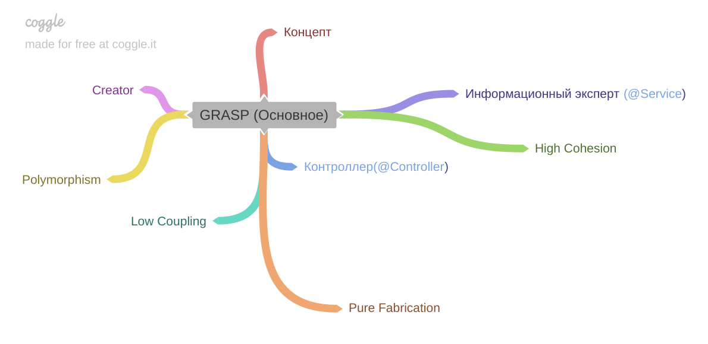
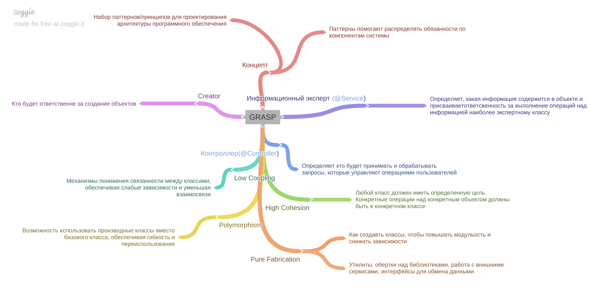

[Вернуться к оглавлению](https://github.com/engine-it-in/different-level-task/blob/main/README.md)
***

***
* [GRASP](#grasp)
  * [Consept](#consept)
  * [Understanding](#understanding)
  * [Patterns](#patterns)
    * [Creator](#creator)
    * [Information Expert (@Service)](#information-expert--service-)
    * [Controller (@Controller)](#controller--controller-)
    * [Low Coupling](#low-coupling)
    * [High Cohesion](#high-cohesion)
    * [Polymorphism](#polymorphism)
    * [Pure Fabrication (@Component)](#pure-fabrication--component-)
***

***
[Визуальный конспект](https://coggle.it/diagram/ZtoQCzbVpak0otmF/t/-/aeacdc321cedf634e3bac254583d85df6295e088cf9f83ebb78643319af862e9)
***

# GRASP

## Concept

* GRASP (General Responsibility Assignment Software Patterns): 
  * Набор паттернов проектирования для проектирования архитектуры программного обеспечения;

## Understanding

* GRASP предоставляет набор паттернов для распределения обязанностей между объектами в системе;

## Patterns

### Creator

* Определяет, какой объект должен быть ответственным за создание других объектов;

### Information Expert (@Service)

* Определяет, какая информация содержится в объекте, и присваивает ответственность 
за выполнение операций над этой информацией наиболее "экспертному" классу;

### Controller (@Controller)

* Определяет, какой объект будет принимать и обрабатывать запросы, 
управляющие операциями пользователя;

### Low Coupling

* Механизм понижения связанности между классами, обеспечивая слабые зависимости и 
уменьшая взаимосвязи;

### High Cohesion

* Парадигма создания класса с ясно определенными и связанными целями, 
чтобы операции, относящиеся к одной задаче, находились в одном классе;

### Polymorphism

* Возможность использовать производные классы вместо базового класса, 
обеспечивая гибкость и переиспользование;

### Pure Fabrication (@Component)

* Как создавать искусственные классы, чтобы улучшить модульность или уменьшить зависимости;
* Пример: различные утилиты, обертки для сторонних библиотек, классы для работы 
с внешними сервисами или интерфейсы для обмена данными между компонентами системы;
