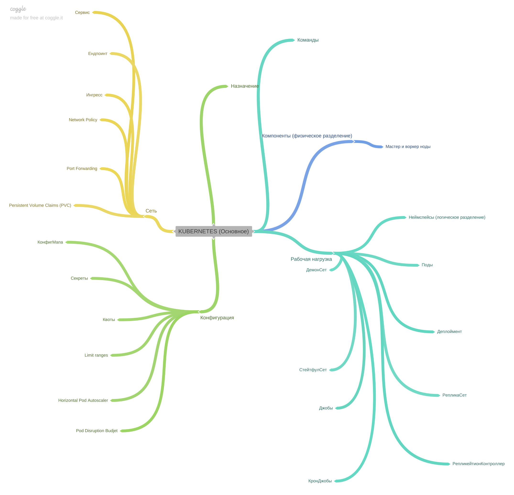
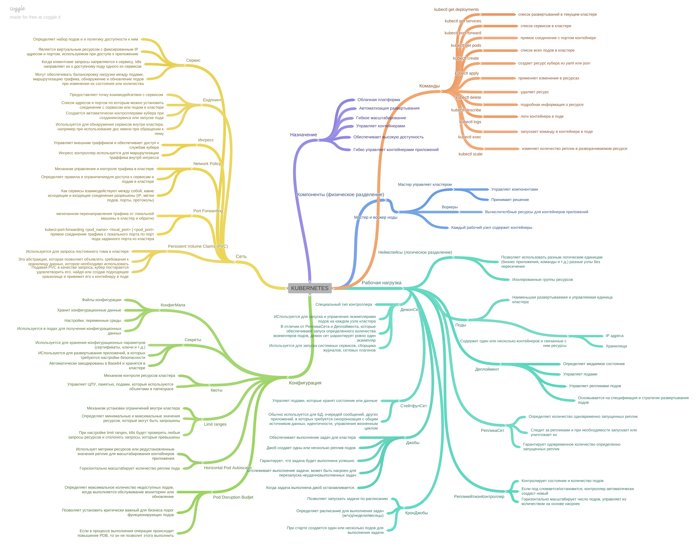

[Вернуться к оглавлению](https://github.com/engine-it-in/different-level-task/blob/main/README.md)
***

***
* [Kubernetes](#kubernetes)
  * [Components](#components)
    * [Master and Worker Nodes](#master-and-worker-nodes)
  * [Workloads](#workloads)
    * [Namespace](#namespace)
    * [Pod](#pod)
    * [Deployment](#deployment)
    * [DaemonSet](#daemonset)
    * [StatefulSet](#statefulset)
    * [ReplicaSet](#replicaset)
    * [Replication controller](#replication-controller)
    * [Job](#job)
    * [Cron Job](#cron-job)
  * [Config](#config)
    * [ConfigMap](#configmap)
    * [Secret](#secret)
    * [Quota](#quota)
    * [Limit ranges](#limit-ranges)
    * [HPA (Horizontal Pod Autoscaler)](#hpa--horizontal-pod-autoscaler-)
    * [Pod Disruption Budget (PDB)](#pod-disruption-budget--pdb-)
  * [Network](#network)
    * [Service](#service)
    * [Endpoint](#endpoint)
    * [Ingress](#ingress)
    * [Network Policies](#network-policies)
    * [Port Forwarding](#port-forwarding)
    * [Persistent Volume Claims (PVC)](#persistent-volume-claims--pvc-)
  * [General commands](#general-commands)
***

***
[Визуальный конспект](https://coggle.it/diagram/ZtsoJzbVpak0jWYP/t/kubernetes/d5f96b054e6ee16c2ba3d695d7658921c4c6d12f7d728398dca58be7b1ffa67e)
***

# Kubernetes

* Kubernetes - это платформа для: 
  * автоматизации развертывания; 
  * масштабирования; 
  * управления контейнеризированными приложениями; 
* Обеспечивает: 
  * высокую доступность; 
  * масштабируемость; 
  * отказоустойчивость приложений в контейнерах;

## Components

### Master and Worker Nodes

* Master узел контролирует и управляет кластером Kubernetes; 
* Отвечает за принятие решений и управление другими компонентами: 
  * Worker Nodes предоставляют вычислительные ресурсы для запуска и 
обслуживания приложений в кластере; 
* Каждый рабочий узел содержит контейнер для выполнения программы;

## Workloads

### Namespace

* Логическое разделение кластера на изолированные группы ресурсов;
* Позволяет различным командам и проектам использовать один и 
тот же кластер без конфликтов и пересечений;

### Pod

* Наименьшая развертываемая и управляемая единица в кластере Kubernetes; 
* Содержит один или несколько контейнеров, а также связанные с ним ресурсы:
  * IP-адреса; 
  * Хранилище;

### Deployment

* Определяет желаемое состояние приложения и управляет: 
  * созданием; 
  * обновлением реплик подов; 
* Основывается на его заданных спецификациях и стратегии развертывания;

### ReplicaSet

* Определяет, сколько реплик под должно быть запущено одновременно;
* Следит за текущим состоянием реплик под и, при необходимости,
  создает или уничтожает реплики, чтобы гарантировать,
  что всегда будет запущено определенное количество.
* ReplicaSet может использоваться для масштабирования приложения
  путем увеличения или уменьшения количества реплик под.

### Replication controller

* Контролирует состояние и количество подов в приложении,
  поддерживая указанное количество работающих подов. 
* Если какой-либо под сломается или спонтанно завершится,
  Replication Controller автоматически создаст новый для его замены. 
* Позволяет масштабировать число подов в горизонтальном направлении,
  управляя их количеством на основе установленных правил.

### DaemonSet

* Представляет собой специальный тип контроллера, 
используемый для запуска и управления экземплярами подов 
на каждом узле кластера;
* В отличие от ReplicaSet или Deployment, 
которые обеспечивают запуск определенного количества экземпляров подов в
кластере, 
DaemonSet гарантирует, что на каждом узле в кластере будет запущен 
ровно один экземпляр пода;

* DaemonSet обычно используется для запуска и поддержки системных сервисов, 
таких как мониторинговые агенты, сборщики журналов или сетевые плагины;

### StatefulSet

* Управляет подами, которые хранят какое-либо состояние или данные; 
* Обычно используется для баз данных, очередей сообщений или 
других приложений, требующих уникальных идентификаторов, 
стабильной сетевой идентичности и управления жизненным циклом;

### Job

* Обеспечивает выполнение задачи (job) в кластере; 
* Job создает одну или несколько реплик подов, и гарантирует, что задача
будет выполнена успешно;
* Job отслеживает состояние выполнения задачи и 
может быть настроен для перезапуска задачи в случае ее неудачного выполнения; 
При выполнении задачи, Job создает реплику Pod, 
которая управляет ее выполнением и завершением;
* Когда задача выполнена, Job останавливает или удаляет все созданные 
реплики;

### Cron Job

* Позволяет запускать задачи по расписанию; 
* Определяет расписание для выполнения задачи с 
использованием стандартной нотации cron, которая включает:
  * минуты; 
  * часы; 
  * дни месяца; 
  * месяцы; 
  * дни недели; 
* При наступлении заданного расписания, Cron Job создает один или 
несколько подов, в которых выполняется задача. 
Каждое выполнение создает новый под, таким образом, можно отслеживать 
историю выполнения задачи.

## Config

### ConfigMap

* Хранит конфигурационные данные: 
  * настройки приложений; 
  * переменные среды; 
  * файлы конфигурации; 
* ConfigMap можно использовать в подах для получения 
конфигурационных данных или монтирования их в виде 
файлов внутри контейнеров;

### Secret

* Используется для хранения конфиденциальной информации: 
  * пароли; 
  * ключи API; 
  * сертификаты;
  * и другие;
* Secrets обычно используются при развертывании приложений, 
которые требуют доступа к защищенным ресурсам; 
* Secrets автоматически закодированы в Base64 и 
хранятся внутри кластера Kubernetes.

### Quota

* Механизм для ограничения и контроля ресурсов, используемых в кластере; 
* Позволяет ограничить количество CPU, памяти и
других ресурсов, которые могут быть использованы объектами в namespace;

### Limit ranges

* Механизм для установки ограничений на использование ресурсов: 
  * CPU; 
  * Память внутри кластера;
* Определяют минимальные и максимальные значения для ресурсов, 
которые могут быть запрошены. 
Когда limit ranges настроены для namespace, Kubernetes 
будет проверять любые запросы ресурсов, отправленные в него, 
и отклонять запросы, которые превышают установленные лимиты;

### HPA (Horizontal Pod Autoscaler)

* Горизонтально масштабирует количество реплик подов 
в зависимости от текущей нагрузки на приложения;
* HPA использует метрики, такие как загрузка CPU или 
использование пользовательской определенной метрики, чтобы принимать
решение о масштабировании количества реплик;

### Pod Disruption Budget (PDB)

* Определяет максимальное количество недоступных подов, 
когда выполняется обслуживание, мониторинг или обновления;
* Позволяет установить критически важный для бизнеса минимум 
работающих подов. Если выполняемая операция приведет к превышению 
заданного PDB, Kubernetes не позволит выполнить эту операцию;

## Network

### Service

* Определяет набор подов и политику доступности к этим подам;
* Является виртуальным ресурсом с фиксированным IP-адресом и портом 
  * Клиенты могут использовать для обращения к приложению; 
* Когда клиентские запросы направляются к сервису, 
Kubernetes автоматически перенаправляет их к одному из доступных подов, 
соответствующих сервису;
* Сервисы также могут обеспечивать возможность балансировки нагрузки 
между подами, маршрутизации трафика, обнаружение и 
автоматическое обновление подов при изменении их состояния или количества;

### Endpoint

* Список IP-адресов и портов, по которым можно установить соединение 
с сервисом или подом в кластере Kubernetes;
* Endpoint создается автоматически контроллерами Kubernetes 
при создании сервиса или запуске подов, и предоставляет точку доступа 
для взаимодействия с сервисом или подом;
* Endpoint используется для обнаружения сервисов 
другими сервисами внутри кластера, например, при использовании 
DNS-имени сервиса для обращения к нему;

### Ingress

* Механизм для управления внешним трафиком и обеспечения доступа 
к службам Kubernetes;
* Ingress контроллер используется для управления входящим трафиком и 
маршрутизации его к соответствующей службе внутри кластера, 
в зависимости от правил конфигурации Ingress;

### Network Policies

* Механизм для управления и контроля сетевого трафика в кластере Kubernetes. 
* Они позволяют определить правила и ограничения для доступа 
к сервисам и подам в сети Kubernetes;
* С помощью Network Policies можно определить, какие сервисы и поды 
могут взаимодействовать между собой по сети, а также какие входящие и 
исходящие соединения разрешены;
* При определении Network Policies можно использовать различные 
критерии для фильтрации трафика: 
  * адреса IP; 
  * метки подов; 
  * порты и протоколы;

### Port Forwarding

* Механизм, который позволяет перенаправлять сетевой трафик от 
локальной машины к кластеру Kubernetes и обратно;
* Команда `kubectl port-forward` в Kubernetes позволяет 
установить прямое соединение с определенным подом или сервисом в кластере; 
* Например, при выполнении 
`kubectl port-forward <pod_name> <local_port> |<pod_port>` трафик, 
направленный на local_port локальной машины, 
будет перенаправлен на pod_port заданного пода в кластере;

### Persistent Volume Claims (PVC)

* Используется для запроса постоянного тома (Persistent Volume) 
в кластере Kubernetes. PVC представляет собой абстракцию, 
которая позволяет пользователям объявлять требования к хранилищу данных, 
которое им необходимо использовать;
* Подавая PVC в качестве запроса, 
Kubernetes постарается удовлетворить его, найдя или создав подходящий 
Persistent Volume, который соответствует требованиям PVC, 
и привязать его к контейнеру в поде;

## General commands

| Command                 | Description                                                                  |
|-------------------------|------------------------------------------------------------------------------|
| kubectl get pods        | показывает список всех подов в текущем контексте кластера Kubernetes         |
| kubectl create          | создает ресурс Kubernetes из YAML или JSON файла                             |
| kubectl apply           | применяет изменения в развернутых ресурсах Kubernetes                        |
| kubectl delete          | удаляет ресурс Kubernetes                                                    |
| kubectl describe        | отображает подробную информацию о ресурсе Kubernetes                         |
| kubectl logs            | показывает логи контейнера в поде                                            |
| kubectl exec            | запускает команду в контейнере в поде                                        |
| kubectl port-forward    | устанавливает прямое соединение с портом контейнера                          |
| kubectl scale           | изменяет количество реплик в разворачиваемом ресурсе                         |
| kubectl get services    | показывает список всех сервисов в текущем контексте кластера Kubernetes      |
| kubectl get deployments | показывает список всех развертываний в текущем контексте кластера Kubernetes |
