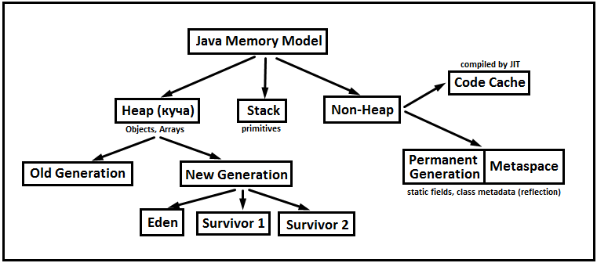

[Вернуться к оглавлению](https://github.com/engine-it-in/different-level-task/blob/main/README.md)
***

* [Java memory](#java-memory)
    * [Concepts](#concepts)
    * [Recommendations](#recommendations)
    * [Garbage Collector](#garbage-collector)

***

# Java memory

статьи

* https://appmaster.io/ru/blog/arkhitektura-virtual-noi-mashiny-java
* https://proselyte.net/jvm-basics/
* https://struchkov.dev/blog/ru/memory-in-java/

# Java memory



* В JVM, традиционно память разделяют на 2 категории:
    * Стек - область памяти, где функции хранят переменные и информацию для выполнения;
        * Cтек реализован в виде стека структуры данных (LIFO);
        * Обеспечивает быстрый доступ к данным;
        * Обеспечивает автоматическое управление адресным пространством;
        * Имеет ограниченный размер;
        * Если попытаться использовать больше доступной стековой памяти, то возникнет StackOverflowError;
        * Для каждого потока выделяется свой фрейм;
    * Куча - область памяти, где данные размещаются автоматически, во время выполнения программы;
        * Данные остаются, пока их явно не удалить;
        * Память распределяется динамически во время выполнения программы;
        * Если памяти не хватает, то она запрашивается у ОС;
        * Память надо освободить и вернуть ОС, а иначе есть риск утечек;
        * Доступ к памяти медленнее, чем у стека;
        * Явно управлять памятью ненужно - это делает GC;

## Многопоточность

* У каждого потока свой фрейм стека, но куча для всех одна;

## Concepts

* Объекты в Java создаются с использованием оператора `new`;
* Память для объектов выделяется в куче (heap memory);
* Каждый объект должен быть явно освобожден с помощью сборщика мусора,
  тогда он становится недоступным;
* Нет необходимости вручную удалять объекты;
* Классы в Java создаются в области памяти, называемой метод-область (method area),
  и каждый класс имеет только один экземпляр в памяти;

## Recommendations

Практические рекомендации для работы с памятью в Java:

* Избегать создания ненужных объектов, особенно в циклах, чтобы избежать
  перенаполнения кучи;
* Использовать локальные переменные, когда это возможно, вместо полей объектов.
  Локальные переменные освобождаются сразу после их использования, в то время как
  поля объектов могут существовать дольше, даже если они больше не нужны;
* Обнулять ссылки на объекты, когда они больше не используются.
  Это позволит сборщику мусора освободить память быстрее;
* Использовать `try-with-resources` (начиная с Java 7) для автоматического
  закрытия ресурсов (файлы или сетевые соединения), после их использования.
  Это гарантирует правильное освобождение памяти;
* Использовать потоковые (`stream`) операции,
  которые позволяют обрабатывать данные кусками и занимают минимум памяти;
* Увеличение объема памяти для JVM регулируется параметром -Xmx
  (например, -Xmx4g означает 4 гигабайта памяти).

## Garbage Collector

* Сборщик мусора в Java автоматически управляет памятью и освобождает объекты,
которые больше не используются в программе.
* Работает в фоновом режиме и предоставляет следующие шаги для освобождения памяти:
  * Маркировка: Сборщик мусора начинает с корневых объектов,
    которые обычно являются статическими переменными или ссылками на объекты
    в потоках выполнения. Он маркирует все доступные объекты, которые достижимы
    из корневых объектов;
  * Определение: Сборщик мусора определяет, какие объекты не могут быть
    достигнуты из корневых объектов и помечает их для удаления;
  * Очистка: Помеченные объекты удаляются из памяти, и их пространство освобождается
    для будущего использования;
  * Сборщик мусора в Java использует алгоритм, называемый "поколениями". 
    * Он делит все объекты на несколько поколений на основе их времени жизни. 
    * Новые объекты помещаются в "молодое поколение" (young generation),
      где сборка мусора происходит достаточно часто. 
    * Если объекты выживают достаточно долго, они перемещаются в "старое
      поколение" (old generation), где сборка мусора выполняется реже. 
    * Так же называются области в куче (young, survivor 0? 1);
    * Java предоставляет возможность вручную вызывать сборку мусора с помощью метода System.gc(); 

## Типы ссылок

**GC при работе с данными в куче руководствуется типами ссылок:**

* Сильные, они же обычные, нужны для указания на объекты, 
которые должны обязательно оставаться в памяти всё время, что эти ссылки на него существуют. 
Если не складывается - OutOfMemoryError;
```java
Object object = new Object();//создал обьект 
object = null;//теперь может быть собран сборщиком мусора
```
* Мягкие ссылки полезны для кэшей, чувствительных к доступному объёму оперативной памяти. 
Объекты по ним могут зачиститься, но только в случае необходимости. 
Например, если нужно создать ещё объектов с сильными ссылками, а уже негде, 
лучше освободить кэш и замедлить работу, чем уронить процесс напрочь;
```java
// какой-то объект
Object object= new Object ();
// слабая ссылка на него
WeakReference<Object > weakStudent = new WeakReference<Object>(object);
// теперь объект Object может быть собран сборщиком мусора
object = null;
```
* Слабые ссылки полезны для сопоставления объектов чему-нибудь без удерживания их от 
зачистки когда они больше не нужны. 
На возможность зачистки они не влияют вообще никак, 
слабые ссылки будут очищены при очередном запуске сборщика;
```java
// какой-то объект
Object object= new Object ();
// слабая ссылка на него
SoftReference<Object > softStudent = new SoftReference<Object >(object)
// теперь объект Student может быть собран сборщиком мусора
// но это случится только в случае сильной необходимости JVM в памяти
object= null;
```
* Фантомные ссылки возникают, когда объект уже признан мусором, 
финализирован и находится в процессе зачистки, 
о чём можно узнать с помощью класса Cleaner 
и выполнить в это время какие-то собственные действия;