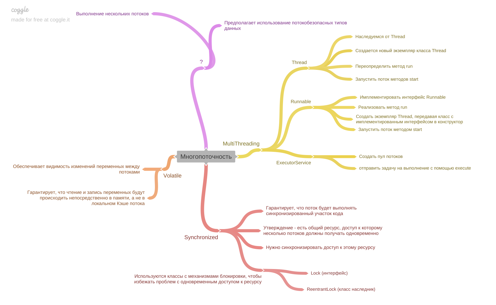

[Вернуться к оглавлению](https://github.com/engine-it-in/different-level-task/blob/main/README.md)
***
* [Multithreading](#multithreading)
  * [Thread](#thread)
  * [Runnable](#runnable)
  * [ExecutorService](#executorservice)
  * [Synchronized](#synchronized)
  * [Volatile](#volatile)
***

***
[Визуальный конспект](https://coggle.it/diagram/ZuF1qaWLaORTtUmz/t/%D0%BC%D0%BD%D0%BE%D0%B3%D0%BE%D0%BF%D0%BE%D1%82%D0%BE%D1%87%D0%BD%D0%BE%D1%81%D1%82%D1%8C/b93fb3ff56f92917f384824d1acaf7757b4b0747fe69914a1c0a71492eec27f7)
***

Статьи - https://github.com/KFalcon2022/lessons/blob/master/roadmap/Road%20Map.md

# Multithreading

В Java существует несколько подходов к работе с многопоточностью;

## Thread

* Создать новый экземпляр класса Thread;
* Переопределить метод run() для определения задачи, которую поток будет выполнять; 
* Запустить поток с помощью метода start();

```java
class MyThread extends Thread {
    @Override
    public void run() {
        // Ваш код для выполнения задачи
    }
}
    .....
    // Создание и запуск потока
    MyThread thread = new MyThread();
    thread.start();
```

## Runnable

* Имплементировать интерфейс Runnable
* Реализовать метод run() для определения задачи потока; 
* Создать экземпляр класса Thread, передавая экземпляр Runnable в конструктор; 
* Запустить поток с помощью метода start();

```java
class MyRunnable implements Runnable {
    @Override
    public void run() {
        // Ваш код для выполнения задачи
    }
}
    .....
    // Создание и запуск потока
    Thread thread = new Thread(new MyRunnable());
    thread.start();
```

## ExecutorService

* Создать пул потоков с помощью метода `Executors.newFixedThreadPool()` 
* Получить экземпляр ExecutorService и отправить задачу (`Runnable`) на выполнение с помощью метода execute().

```java
ExecutorService executorService=Executors.newFixedThreadPool(5);
        executorService.execute(new Runnable() {
            @Override
            public void run(){
                    // Ваш код для выполнения задачи
                    }
                    });
            // Завершение работы пула потоков после выполнения всех задач
                    executorService.shutdown(); 
```

## Synchronized

* Есть общий ресурс, доступ к которому могут получать несколько потоков одновременно;
* Следует синхронизировать доступ к этому ресурсу:
  * C помощью ключевого слова `synchronized`
  * Использовать классы с механизмами блокировки, чтобы избежать проблем с одновременным доступом к ресурсу, такие как 
    * `Lock` (интерфейс) 
    * `ReentrantLock`(класс наследник), 
* Ключевое слово `synchronized` позволяет синхронизировать доступ к блоку кода или методу;
* `synchronized` гарантирует, что поток будет выполнять синхронизированный участок кода;

## Volatile

* Ключевое слово `volatile` позволяет обеспечить видимость изменений переменных между потоками; 
* `volatile` гарантирует, что чтение и запись переменных будут происходить непосредственно 
в памяти, а не в локальном кэше потока;