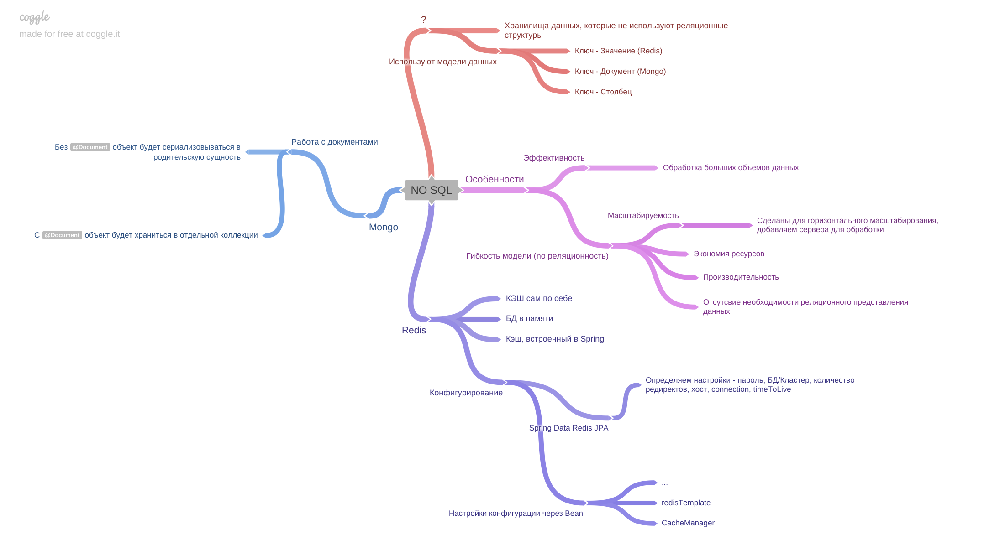

[Вернуться к оглавлению](https://github.com/engine-it-in/different-level-task/blob/main/README.md)
***
* [NoSQL](#nosql)
  * [Redis](#redis)
    * [Example:](#example-)
    * [Configurations](#configurations)
    * [Properties](#properties)
    * [Annotations](#annotations)
  * [MongoDB](#mongodb)
    * [Вложенные документы (классы)](#вложенные-документы--классы-)
***

***
[Визуальный конспект](https://coggle.it/diagram/Zt8De4Kz-e0Wru7F/t/no-sql/fb59d16e504298c0737788df171b07f291a8830cab0c7433accf6c708d6f79a0)
***

# NoSQL

* NoSQL - хранилища данных, которые не используют реляционные структуры (RDBMS);
* NoSQL - используют модели данных: 
  * ключ-значение/документ/столбец 
  * граф;

Особенности:

* **Эффективность**: Поддержка очень больших объемов данных по сравнению с традиционными RDBMS.
* **Масштабируемость**: Проектирован для горизонтального масштабирования, позволяя добавлять большее количество серверов
  для обработки большего количества данных;
***Гибкость структур данных**: Отсутствие жесткой схемы таблицы, что позволяет быстрее адаптироваться к меняющимся
  требованиям.

## Redis

* БД в памяти, который используется в качестве базы данных, кеша и брокера сообщений;

### Example:

### Configurations

```java

@EnableCaching
@Configuration
@RequiredArgsConstructor
public class CacheConfig {

    /**
     * RedisConnectionFactory создается Spring'ом из properties приложения
     */
    private final RedisConnectionFactory connectionFactory;

    /**
     * RedisTemplate, использующий кастомный ObjectMapper для (де)сериализации
     *
     * @return RedisTemplate
     */
    @Bean
    public RedisTemplate<String, Person> redisTemplate() {
        // Создаем RedisTemplate, типизируемый требуемыми типами (ключ, значение)
        final RedisTemplate<String, Person> redisTemplate = new RedisTemplate<>();
        redisTemplate.setConnectionFactory(connectionFactory);

        // Создаем кастомный objectMapper
        final ObjectMapper objectMapper =
                new ObjectMapper()
                        // Добавляем mixin, который убирает age из кэша
                        .addMixIn(Person.class, PersonCacheMixin.class)
                        // Добавляем описания типов в Cache (для десериализации)
                        .activateDefaultTyping(
                                LaissezFaireSubTypeValidator.instance,
                                ObjectMapper.DefaultTyping.EVERYTHING,
                                JsonTypeInfo.As.PROPERTY
                        );

        // Создаем кастомный сериалайзер, который использует OM, созданный выше
        final GenericJackson2JsonRedisSerializer serializer =
                new GenericJackson2JsonRedisSerializer(objectMapper);

        // Указываем чем сериализовать ключи и значения
        redisTemplate.setKeySerializer(new StringRedisSerializer());
        redisTemplate.setValueSerializer(serializer);
        redisTemplate.afterPropertiesSet();
        return redisTemplate;
    }

    /**
     * Возвращает cacheManager, который использует сконфигурированный redisTemplate для кэширования
     *
     * @param redisTemplate RedisTemplate, созданный ранее
     * @return CacheManager
     */
    @Bean
    public CacheManager cacheManager(
            RedisTemplate<String, Person> redisTemplate
    ) {
        return RedisCacheManager
                .builder(connectionFactory)
                .cacheDefaults(
                        RedisCacheConfiguration
                                .defaultCacheConfig()
                                .serializeValuesWith(
                                        RedisSerializationContext
                                                .SerializationPair
                                                .fromSerializer(redisTemplate.getValueSerializer())
                                )
                )
                .build();
    }

    /**
     * Генератор ключей для Cache
     *
     * @return KeyGenerator
     */
    @Bean
    public KeyGenerator personCacheKeyGenerator() {
        return (target, method, params) -> {
            if (params[0] instanceof String name) {
                return name;
            } else {
                return ((Person) params[0]).firstName();
            }
        };
    }
```

### Properties

```yaml
spring:
  data:
    redis:
      host: localhost
      port: 6379
  cache:
    type: redis
    redis:
      time-to-live: 1m
```

### Annotations

```java

@Service
@Log4j2
// Верхнеуровневая конфигурация (указываем имя cache)
@CacheConfig(cacheNames = "person")
public class PersonService {

    // Значение будет кэшироваться с ключом, который сгенерирует бин personCacheKeyGenerator
    @Cacheable(keyGenerator = "personCacheKeyGenerator")
    public Person getPerson(String name) {
        log.info("creating new person with name `{}`", name);
        return new Person(
                name,
                RandomStringUtils.randomAlphanumeric(20),
                RandomUtils.nextInt(),
                List.of(
                        new Person(RandomStringUtils.randomAlphabetic(10),
                                RandomStringUtils.randomAlphabetic(20), RandomUtils.nextInt()),
                        new Person(RandomStringUtils.randomAlphabetic(10),
                                RandomStringUtils.randomAlphabetic(20), RandomUtils.nextInt())
                )
        );
    }

    // Кэш по ключу, который сгенерирует personCacheKeyGenerator, будет инвалидирован
    @CacheEvict(keyGenerator = "personCacheKeyGenerator")
    public void clearCache(Person person) {
        log.info("Clearing cache for {}", person.firstName());
    }

}
```

## MongoDB

* MongoDB — документо-ориентированная база данных, которая хранит данные в формате BSON (двоичный аналог JSON); 
* MongoDB является одной из самых популярных NoSQL баз данных благодаря своей гибкости и простоте использования;
* Данные можно помещать в БД с помощью

```java
public interface UserRepository extends MongoRepository<User, String> {

    Optional<User> findByUsername(String username);

}
```

Создаем entity:

```java

@Document(collection = "users")
public class User {

    @Id
    private String id;
    private String username;
    private String email;
    private LocalDate birthDate;
}
```

### Вложенные документы (классы)

* По умолчанию, при использовании вложенных объектов и без аннотаций @Document, Spring Data MongoDB будет сериализовать
объект как вложенный документ в родительский документ; 
* Если требуется хранить объект в отдельной коллекции, необходимо
аннотировать его меткой `@Document` и обрабатывать его как отдельную сущность с собственным репозиторием;