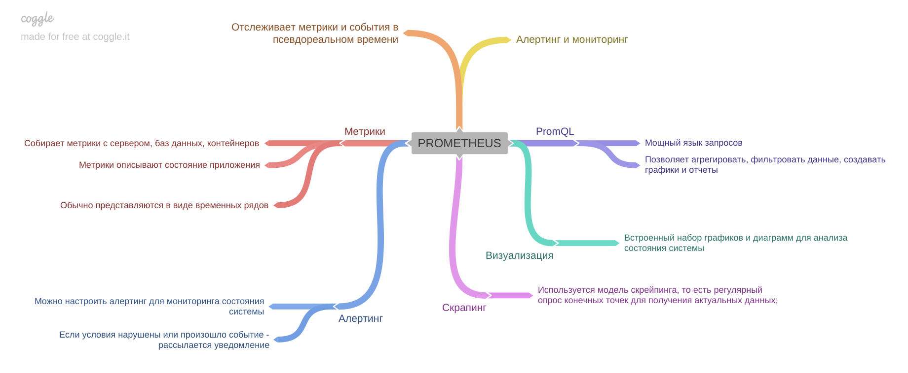

[Вернуться к оглавлению](https://github.com/engine-it-in/different-level-task/blob/main/README.md)
***
* [Prometheus](#prometheus)
  * [Features](#features)
    * [Metrics](#metrics)
    * [Scrapping](#scrapping)
    * [PromQL](#promql)
    * [Alerting](#alerting)
    * [Graphs](#graphs)
***

***
[Визуальный конспект](https://coggle.it/diagram/ZtsmZjbVpak0jGJz/t/-/6b45401fc7c7dccb362744d5177c61227c4767f6f0cda1db4c45d13d93365423)
***

# Prometheus

* Cистема мониторинга и алертинга с открытым исходным кодом; 
* Отслеживает метрики и события в реальном времени;

## Features

### Metrics

* Prometheus собирает метрики с различных источников: 
  * серверы; 
  * контейнеры, 
  * базы данных 
  * и т.д; 
* Метрики описывают состояние системы или приложения: 
  * обычно представлены в формате временных рядов;

### Scrapping

* Prometheus использует модель "скрейпинга" для сбора метрик; 
  * Регулярный опрос конечных точек, для получения актуальных данных;

### PromQL

* Prometheus предоставляет мощный язык запросов с названием `PromQL`; 
* Позволяет выполнять сложные запросы, фильтровать и агрегировать данные метрик, 
а также создавать графики и алерты;

### Alerting

* Prometheus позволяет настраивать правила алертинга для мониторинга состояния системы; 
* Когда определенные условия нарушены, Prometheus отправляет оповещения о нарушениях, 
чтобы операторы могли принять меры;

### Graphs

* Prometheus имеет встроенную интерактивную визуализацию данных с возможностью создания графиков, 
диаграмм и дашбордов;
* Это помогает наглядно отслеживать и анализировать метрики;
