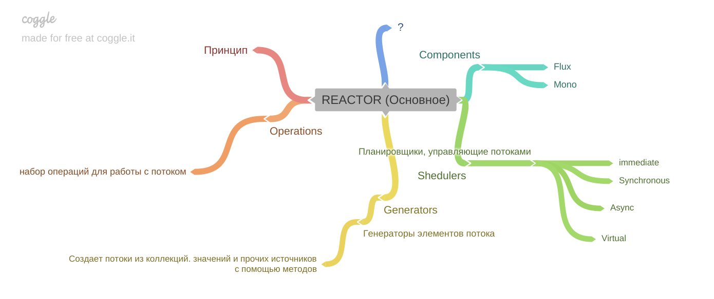
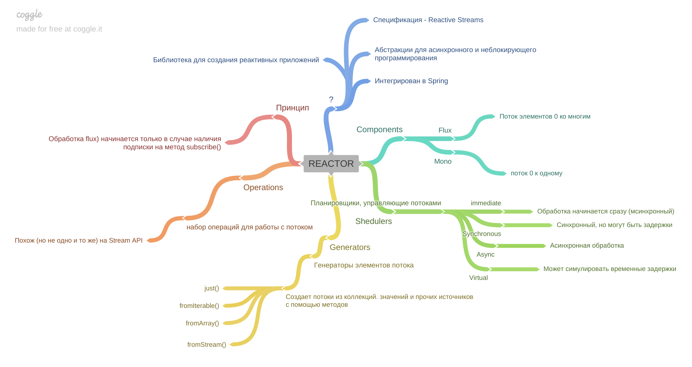

[Вернуться к оглавлению](https://github.com/engine-it-in/different-level-task/blob/main/README.md)
***

***
* [Reactor](#reactor)
  * [Components](#components)
    * [Flux](#flux)
    * [Mono](#mono)
    * [Schedulers](#schedulers)
    * [Generators](#generators)
    * [Operations](#operations)
  * [Principle of work](#principle-of-work)
***

***
[Визуальный конспект](https://coggle.it/diagram/Zt8AA4Kz-e0WqhYA/t/reactor/df8c96d13b1a22bd2dad60529357d5aa5d2c83ab9a6b0e99c4050f7958316a7d)
***

# Reactor

* Reactor — библиотека для создания реактивных приложений на Java; 
* Основывается на спецификации Reactive Streams; 
* Предоставляет абстракции для асинхронного и неблокирующего программирования; 
* Интегрирован со Spring;

## Components

### Flux

* Поток элементов (0 -> n)

### Mono

* Поток элементов (0 -> 1)

### Schedulers
* Механизмы - планировщики, которые управляют потоком.

| Type        | Description                                |
|-------------|--------------------------------------------|
| Immediate   | Обработка начинается сразу (синхронный)    |
| Synchronous | Синхронный, но может использовать задержки |
| Async       | Асинхронная обработка                      |
| Virtual     | Может симулировать временные задержки      |

### Generators

* Генератор элементов потока; 
* Создает потоки из коллекций, значений и проч. с помощью методов 
  * `.just()`; 
  * `fromIterable()`;
  * `fromStream()`; 
  * `fromArray()` и т.п.

### Operations

* Набор операций для работы с потоком; 
* Похож (но не одно и то же) на операции Stream API;

## Principle of work

* Обработка flux начинается только в случае наличия подписки на поток (метод `subscribe()`);