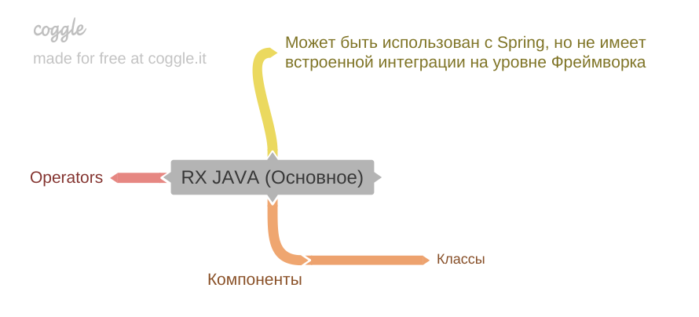
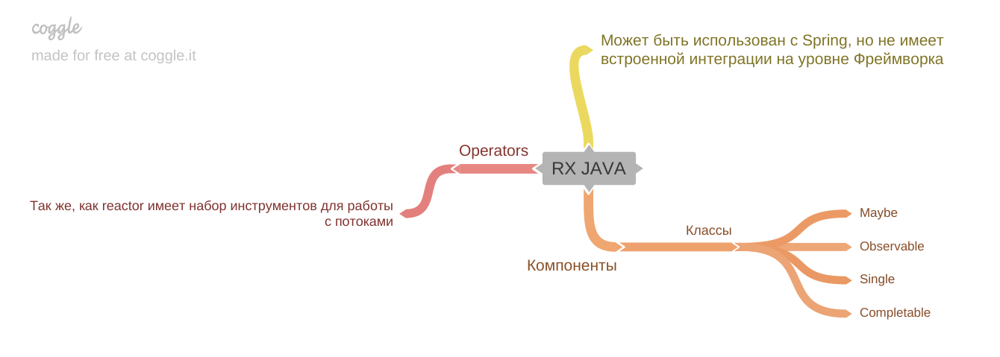

[Вернуться к оглавлению](https://github.com/engine-it-in/different-level-task/blob/main/README.md)
***

***
* [RxJava](#rxjava)
  * [Components](#components)
  * [Operators](#operators)
***

***
[Визуальный конспект](https://coggle.it/diagram/Zt8C1KWLaORTxCTT/t/rx-java/e8bd7674353c7054a51fbfe477027e7d1ae8310e855003fd4cf132a795bc9225)
***

# RxJava

* Может быть использована с Spring, но не имеет встроенной интеграции на уровне фреймворка.

## Components

* Предоставляет классы: 
  * `Observable`; 
  * `Single`; 
  * `Maybe`; 
  * `Completable`
* Классы реализуют различные сценарии работы с потоками данных;

## Operators
* Также, как и Reactor, содержит набор инструментов для работы с потоками.