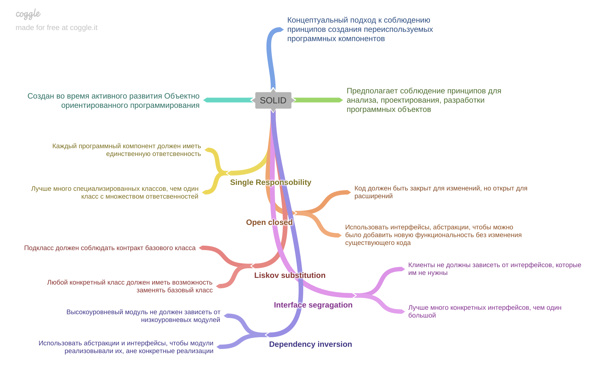

[Вернуться к оглавлению](https://github.com/engine-it-in/different-level-task/blob/main/README.md)
***
* [SOLID](#solid)
  * [Concepts](#concepts)
    * [Single Responsibility](#single-responsibility)
    * [Open-closed](#open-closed)
    * [Liskov Substitution](#liskov-substitution)
    * [Interface segregation](#interface-segregation)
    * [Dependency inversion](#dependency-inversion)
      [Вернуться к оглавлению](https://github.com/engine-it-in/different-level-task/blob/main/README.md)
***

***
[Визуальный конспект](https://coggle.it/diagram/Zti9tjbVpak0fYAY/t/-/9b38a1aa93c0a36aed14ec153b07123b30a2b6ba38ff087cecdec8d99c4c3adc)
***

# SOLID

## Concepts

SOLID подразумевает соблюдение следующих принципов:

- единственной ответственности (Srp);
- открытости/закрытости (Ocp);
- подстановки Барбары Лисков (Lsp);
- разделения интерфейса (Isp);
- инверсии зависимостей (Di).

### Single Responsibility

* Каждый класс или модуль должен иметь только одну единственную ответственность; 
  * Как соблюсти: 
    * разделить функционал на множество классов, каждый из которых будет нести свою единственную функцию;

### Open-closed

* Код должен быть закрыт для изменения и открыт для расширения; 
  * Как соблюсти: 
    * Использовать интерфейсы, полиморфизм и абстракции, чтобы можно было добавить новую функциональность без
    изменения существующего кода;

### Liskov Substitution

* Принцип гарантирует работоспособность кода, зависящего от базового класса, при его замене на подкласс.
  * Как соблюсти: 
    * Подкласс должен соблюдать контракт базового класса.

### Interface segregation

* Клиенты не должны зависеть от интерфейсов, которые им не нужны; 
  * Как соблюсти: разделять интерфейсы на более мелкие и специфичные для конкретных задач;

### Dependency inversion

* Высокоуровневые модули не должны зависеть от низкоуровневых модулей;
  * Как соблюсти:
    * Использовать абстракции и интерфейсы, чтобы модули реализовывали их, а не конкретные реализации;
