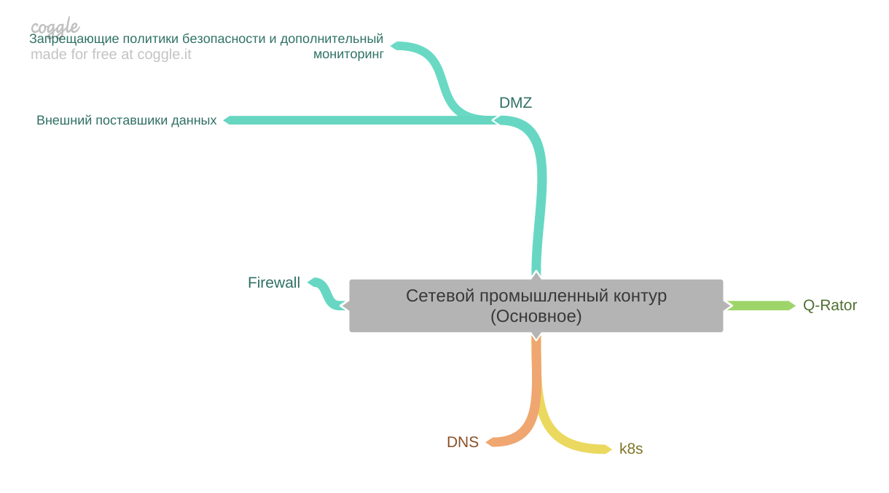
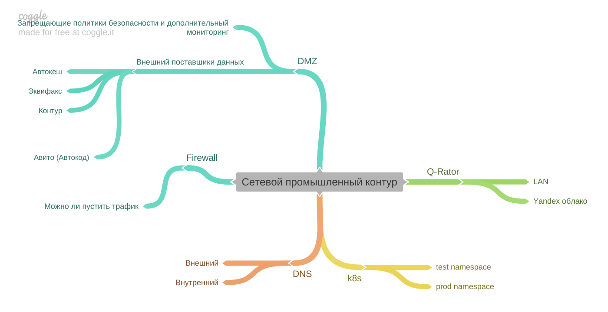

[Вернуться к оглавлению](https://github.com/engine-it-in/different-level-task/blob/main/README.md)
***

***
* [4 части сети](#4-части-сети)
  * [k8s](#k8s)
  * [DNS](#dns)
***

***
[Визуальный конспект](https://coggle.it/diagram/Ztd2XjbVpak0Vt9w/t/-/44816003cb9094c4add385e37d042c9843cf2f2ab742219cb162389413b364ac)
***

# 3 части сети

- DMZ зона 10.x (демилитаризованная сетевая зона) с запрещающими политиками безопасности и дополнительными монитрингами
    - Сервисы, обрабатывающих запросы из внешнего мира
    - защита от ddos
- FireWall
    - проверка трафика (можно ли его пустить в LAN)
- Q-Rator
  - LAN (172.16.x.x)
  - Yandex облако (виртуальная сеть для нас)
  - Куски локальной инфраструктуры для ilog и окружения

## k8s
test namespace
prod namespace

## DNS
- внешний - через интернет
- внутренний - внутри сети