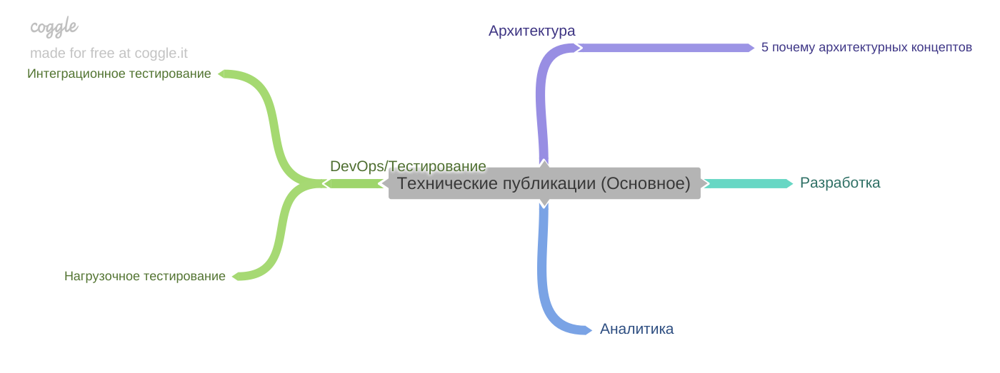
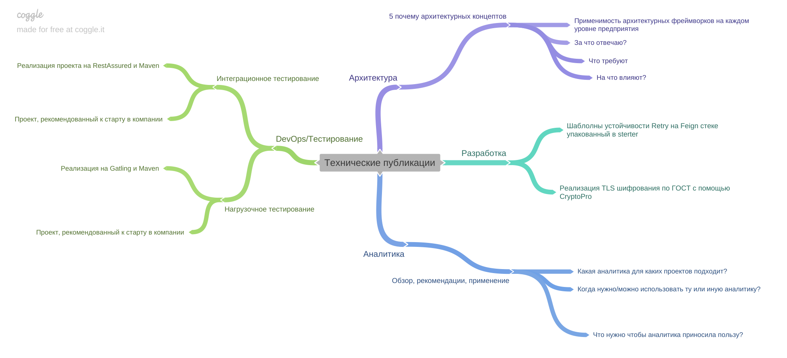

[Вернуться к оглавлению](https://github.com/engine-it-in/different-level-task/blob/main/README.md)
***

***

***
[Визуальный конспект](https://coggle.it/diagram/ZtiEysrvLIwlJpsn/t/-/f71cffd3ebdd60395f7611439b2856da4d0b931179355f9c22ab58c46e7bf2d7)
***

* Retry or No?
  * О чем - реализация шаблона дозапросов при неустойчивом взаимодействии с каким-то источником
  * [Ссылка](https://habr.com/ru/companies/alfastrah/articles/712964/) 
* 5 «Почему» для понимания архитектурных концептов при создании информационных продуктов
  * О чем - статья про уровни архитектуры (корпоративная -> решения) любой компании. Метамодель, основанная на современных фреймворках;
  * [Ссылка](https://habr.com/ru/companies/alfastrah/articles/728366/)
* Аналитика. Обзор, рекомендации, акценты применения
  * О чем - Профиль применимости разных типов и видов анализа для развития информационных технологий;
  * [Ссылка](https://habr.com/ru/companies/alfastrah/articles/748570/)
* Простой, полезный проект интеграционных тестов
  * Реализации шаблонного проекта интеграционных тестов на Rest Assured (взят за стандарт в компании)
  * [Ссылка](https://habr.com/ru/companies/alfastrah/articles/792598/)
* Нагрузи меня, Gatling
  * Реализации шаблонного проекта нагрузочных тестов на Gatling (взят за стандарт в компании)
  * [Ссылка](https://habr.com/ru/companies/alfastrah/articles/808281/)
* Настраиваем TLS контекст. КриптоПро в помощь
  * Пример реализации Гост TLS
  * [Ссылка](https://habr.com/ru/companies/alfastrah/articles/823974/)