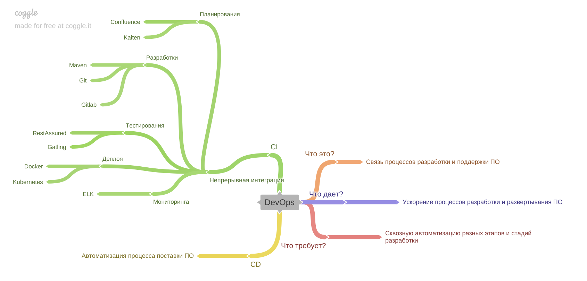

[Вернуться к оглавлению](https://github.com/engine-it-in/different-level-task/blob/main/README.md)
***

***
* [DevOps](#devops)
* [CI](#ci)
* [CD](#cd)
***

***
[Визуальный конспект](https://coggle.it/diagram/Ztdz58rvLIwlMiiC/t/-/6f6b511d43c03f97ec55c016d2767d0ff52ef52c9b258121fc5e079089dbd5a0)
***

# DevOps

* Суть:
  * Философия постулирующая связность процессов разработки и поддержки программного обеспечения;
* Что требует;
  * Стремления к сквозной автоматизации с момента получения данных по задачи до выкатки в прод 
и последующего развития написанного кода;
* Что дает:
  * Ускорение разработки за счет использования надежных компонентов и переиспользования 
  компонентов и подходов, которые подтвердили свою успешность в продуктивной среде; 
* Используемые в компании инструменты:
  * Maven - автоматизация процесса сборки Java проектов;
  * Git - версионирование кода;
  * Gitlab - версионирование проектов;
  * Confluence - база знаний компании;
  * Kaiten - Трекер;
  * Docker - контейниризация приложений;
  * Kubernetes - виртуальная инфраструктура;
  * RestAssured - автоматизация интеграционного тестирования;
  * Gatling/JUnit - автоматизация нагрузочного тестирования;
* Недостатки:
  * Поддержка и сопровождение инструментов;
  * Обновление инструментов;

# CI

* Суть:
  * Подход непрерывной интеграции процесса разработки за счет автоматизации 
всех этапов и деталей от планирования разработки до ее тестирования; 
  * Включает в себя этапы планирования, разработки, сборки и тестирования;
* Чем я помог компании:
  * Шаблонный проект, который был взят за образец - интеграционные тесты на RestAssured;
  * Шаблонный проект, который был взят за образец - нагрузочные тесты на Gatling;

# CD

* Суть:
    * Включает в себя этапы релиза, деплоя, функционирования, мониторинга;
* Чем я помог компании:
    * Шаблонный проект, который был взят за образец - тесты доступности на RestAssured;
