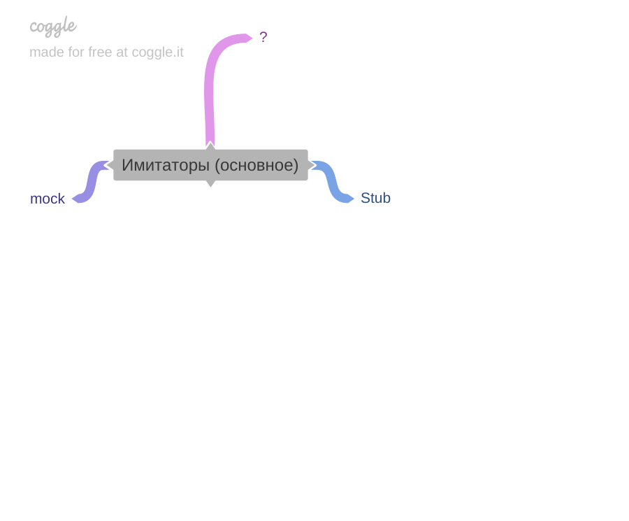
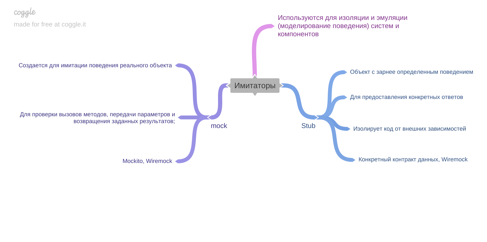

[Вернуться к оглавлению](https://github.com/engine-it-in/different-level-task/blob/main/README.md)
***

***
* [Общее](#общее)
  * [MOCK](#mock)
  * [STUB](#stub)
***

***
[Визуальный конспект](https://coggle.it/diagram/ZtYbQTbVpak0H-Hu/t/-/271b9711873cd608c1239d030c2da1fd0fff7bf1caac9d266f113efbc69fe3c2)
***

# Общее:

* MOCK и STUB - объекты имитаторы, используемые для изоляции и эмуляции систем или ее компонентов 

## MOCK:
* **Что это** - Создается для имитации поведения реального объекта;
* **Использование** - Для проверки вызовов методов, передачи параметров и возвращения заданных результатов;
* **Пример** - Mockito;

## STUB:
* **Что это** - Объект с заранее определенным поведением;
* **Использование** - Для предоставления конкретных ответов и изолировать код от зависимостей;
* **Пример** - Wiremock;
